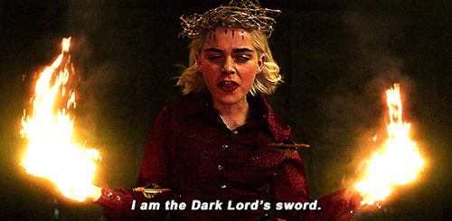

# Nightmare Notebooks

This is a collection of horrible notebooks that you should only look at once you've steeled yourself and your core beliefs.

There be dragons, here.

  

These Notebooks are some of the worst examples we could think of, to show what can go terribly terrible wrong when writing Notebooks. For the sake of everyone's education, these are as terse as possible and get right at the heart of the failures, bugs, and confusions that abound. Do __not__ use these Notebooks as references for any of your development, and do __not__ try to suss out any convenient _tricks_ from them.

  

## Why Create This?

If these are all terrible things to do, then why even have them written out?

Well, like most things in life, we learn by failure or abject terror.

We've created these terrible "nightmare" Notebooks to point out what can go horribly wrong and what you shouldn't do. While elsewhere in this repository we have tolerably "good" Notebooks -- as "good" as any Notebook _can_ be -- there's really no "good" without the "bad".

  

This is a public service announcement of bad code, janky aliases, memory stomping, and all the things you shouldn't do.

Learn what __not__ to do! And then go out in the world and write good code! Be fruitful and multiply! Be helpful and document!

  

